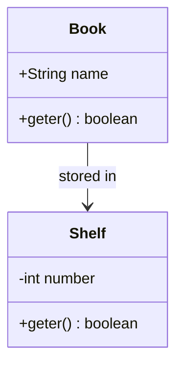

# Silicon Valley: The Tech Cartel

## How To Run

## Class UML

```mermaid
classDiagram
    class Book {
        +String name
        +geter() boolean
    }

    class Shelf {
        -int number
        +geter() boolean
    }

    Book --> Shelf : stored in
```

## Game Logic

## Work Distribution
